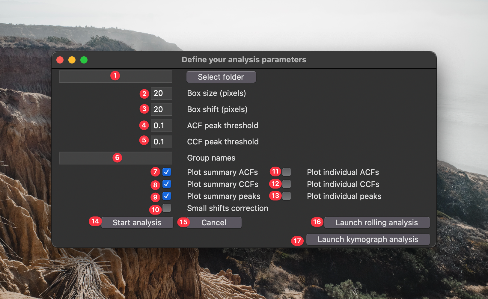
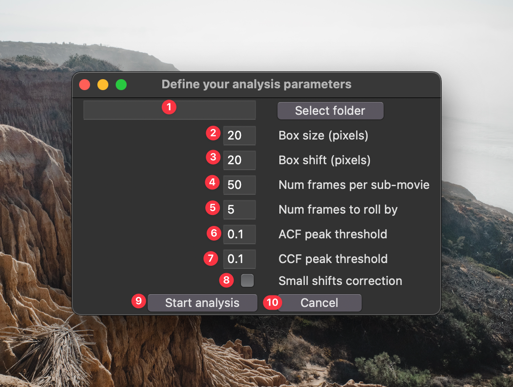

# Wave analysis scripts
This workflow was written to batch analyze excitable / oscillatory dynamics in multichannel time lapse datasets. It was inspired by a MATLAB framework written by Marcin Leda and Andrew Goryachev (published in Bement _et al.,_ 2015; PMID 26479320) and was reimagined here to increase speed, accuracy, and access. This pipeline analyzes signal period, amplitude, temporal duration, and (if applicable) the temporal shift between signals in short time lapse datasets (tens of frames, typically). We have also extended the ability to analyze these metrics between arbitrary numbers of channels and across extended time-lapse datasets (hundreds - thousands of frames).

## Overview

### Standard analysis

In this workflow, each channel is broken up in n boxes (the box size will depend on the size of the features of interest):

And each box is measured independently as follows:

The mean pixel intensity in each box, when viewed over time, is a readout for the oscillatory dynamics in that region. For each channel, the period of the oscillatory signal can be estimated by calculating the autocorrelation of that signal.

For multi-channel datasets, the temporal shift between the two signals is estimated by computing the cross-correlation of the channels. Additionally, it quantifies the shift as a percentage of the period (Phase Shift), offering a valuable means of normalizing data, particularly when dealing with varying periods.

Oscillation properties (e.g., signal peak, signal trough, signal amplitude, temporal duration) can be determined from each waveform. As a precaution for noisy data, which real-world data are more often than not, the signal are smoothed using a Savitzky–Golay filter to avoid quantifying spurious peaks.

Once each box has been independently quantified, they can be combined to estimate properties of the wave population. For example, in the example above we measured a period of 12 frames, is that measurement representative of the whole sample? By looking at the distribution of all period measurements, we can see that it is. 

Similarly, we can assess the population of signal shift measurements, and oscillation/wave properties.

If different groups are specified within the GUI, the script will generate a folder full of plots comparing basic signal properties between groups.

### Rolling analysis
The above workflow describes the analysis of datasets over the totality of their time axis. This is perfectly suitable for data containing only a few wave (or oscillation) periods. However, if your data instead contains tens, hundreds, or thousands of wave periods this analysis will be insufficient. Instead, we can calculate the dynamics within short and overlapping sub-sections of the dataset to track the changes in wave/oscillation properties over time.

### Kymograph analysis
The standard analysis method excels when capturing the wave dynamics of a cell from either a "top-down" or "en-face" perspective. However, a  drawback of en-face image capture is its reliance on multiple z-stacks to accommodate non-flat surfaces, resulting in longer time intervals between frames and potentially missing subtle temporal shifts among different signals. One strategy to alleviate this issue is to focus on a single medial slice of the edge of the cell, leading a single line of waves. Therefore, using a kymograph might be a preferred method to generate wave profiles compared to the binned box method above. 

So, we introduced a new method to conduct the same analysis as above with kymographs. Instead of dividing the image into boxes for temporal wave property measurements, we opt to segment entire columns of a kymograph. By assessing the fluorescence intensity along these columns, we can analyze the same parameters as with the standard method.

## Preparing data for analysis
Before running any analysis on your data, be sure to complete all necessary pre-processing steps. Some thing to consider:
- Any significant two-dimensional drift in your data will alter the detected wave dynamics. If drift is detectable, register your data ahead of time.
- Black spaces (e.g. from drift correction, or true background) should be cropped out.
- Bleaching or z-drift will both affect amplitude and width measurements. The best approach is to not have bleaching/drift to begin with as bleach correction algorithms can introduce their own artifacts. However, if desired, correct your data for bleaching before analyzing.
- The ideal dataset for standard and kymograph analysis will include only a few wave periods which are consistent in character. The ideal dataset for rolling analysis will include many wave periods (tens-thousands) which vary in character over time. 
- This tool draws on imageJ metadata to determine which dimensions are time, channels, slices, etc. Be sure that your files are saved appropriately before analyzing. If your metadata does not have the pixel size or frame interval accurately stored, it will just default to 1 for each.
- If files with more than one z plane are analyzed, the tool will max project them along the z-axis before analyzing.
- Currently, this tool agnostically analyzes the entire image. If you wish to only analyze a specific region, crop it into a separate file. In the future, I plan to incorporate the ability to pass in a mask to specifically measure one or more sub-regions of the image (e.g., to separate out measurements from individual cells, or separate out background regions). 

## Install and run code

In this section I will assume that you have no idea what Python is, or how to use it. If you already know how to use Python and Conda, you can skip ahead. 

1) Go to the mambaforge website and download/install the appropriate distribution of [mambaforge](https://mamba.readthedocs.io/en/latest/installation.html) for your operating system. 
2) Open the miniforge prompt.
3) Make a new virtual environment with `mamba create -n myenv python=3.9 -y`
4) Activate your new environment with `conda activate myenv`
5) Install this repo with `pip install git+https://github.com/zacswider/waveAnalysis.git`
6) Launch the gui with `python -m waveanalysis` 
7) Next a window will appear asking you for some parameters to adjust:

1) This is the source directory for your analysis. Navigate to it using the "Select source directory button". This directory should have one or more time lapse datasets saved in standard standard `tzcyx` order. If the data are not max projected along the z-axis prior to analysis, they will be max projected by the processing script.
2) This is the box size used for analysis. Boxes should be large enough to filter out noise, but small enough that they don't over-fill the structures being analyzed. A good way to empirically find the appropriate box size is to open your data in [FIJI](https://imagej.net/software/fiji/), draw a box with the rectangle selection tool, open up the z-axis profile plotter `Image > Stacks > Plot Z-axis Profile`, click the "Live" button, and adjust the box dimensions to find a size that you feel like accurately captures the temporal dynamics.
3) This is the spatial shift between boxes. If you want to analyze non-overlapping segments of your images, make this the same as the box size. If you want maximum overlap between boxes, set this to 1. If you want to sparsely quantify your images (e.g., for speed) set this to a value greater than your box size.
4) The is the minimum prominence in the autocorrelation curve to be considered a genuine period. Using the default parameter `0.1`, 
5) If you want to compare the population measurements between different groups, enter the groups names in this space. These names *must* be present within the names of the file being processed. A single data set cannot match multiple groups.
6) If you check this box, a graphical output of the population autocorrelation will be saved to the analysis folder.
7) If you check this box, a graphical output of the population crosscorrelation will be saved to the analysis folder.
8) If you check this box, a graphical output of the population wave peak analysis will be saved to the analysis folder.
** Options 6-8 execute very quickly and are set on as a default. You can disable them if you really need to go fast. 
9) If you check this box, a graphical output of the autocorrelation for _each box_ will be saved to the analysis folder.
10) If you check this box, a graphical output of the crosscorrelation for _each box_ will be saved to the analysis folder.
11) If you check this box, a graphical output of the wave peak properties for _each box_ will be saved to the analysis folder.
** Options 9-11 can be very useful to see how accurately the script is identifying your signal properties. However, depending on how densely you sample your images, executing these options can be very slow. I recommend very sparsely analyzing your images (i.e., choose a large box shift) to avoid writing hundreds (or thousands) of individual graphs to your computer.
12) Click this button to start the analysis.
13) Click this button if you're not ready to start the analysis.
14) Click this button if you want to launch the GUI for rolling analysis. 

### Rolling analysis

If you clicked button 14 in the previous GUI, the following window will appear:

1) This is the source directory for your analysis. Navigate to it using the "Select source directory button". This directory should have one or more time lapse datasets saved in standard standard `tzcyx` order. If the data are not max projected along the z-axis prior to analysis, they will be max projected by the processing script.
2) This is the box size used for analysis. Boxes should be large enough to filter out noise, but small enough that they don't over-fill the structures being analyzed. A good way to empirically find the appropriate box size is to open your data in [FIJI](https://imagej.net/software/fiji/), draw a box with the rectangle selection tool, open up the z-axis profile plotter `Image > Stacks > Plot Z-axis Profile`, click the "Live" button, and adjust the box dimensions to find a size that you feel like accurately captures the temporal dynamics.
3) This is the spatial shift between boxes. If you want to analyze non-overlapping segments of your images, make this the same as the box size. If you want maximum overlap between boxes, set this to 1. If you want to sparsely quantify your images (e.g., for speed) set this to a value greater than your box size.
3) This is the number of frames in each sub-movie. This should cover at least a few wave periods to ensure accurate period measurements.
4) This is the number of frames to roll forward each sub-movie. The smaller the number, the more finely you will samples the waves over time.
5) The is the minimum prominence in the autocorrelation curve to be considered a genuine period. Using the default parameter `0.1`, 
6) Click this button to start the analysis.
7) Click this button if you're not ready to start the analysis.

### Kymograph analysis

If you clicked button 15 in the previous GUI, the following window will appear:

1) This is the source directory for your analysis. Navigate to it using the "Select source directory button". This directory should have one or more time lapse datasets saved in standard standard `tzcyx` order. If the data are not max projected along the z-axis prior to analysis, they will be max projected by the processing script.
2) This is the line width used for analysis. Lines should be large enough to filter out noise, but small enough that they don't over-fill the structures being analyzed.
3) This is the spatial shift between lines. If you want to analyze non-overlapping segments of your images, make this the same as the line width. If you want maximum overlap between boxes, set this to 1. If you want to sparsely quantify your images (e.g., for speed) set this to a value greater than your box size.
4) The is the minimum prominence in the autocorrelation curve to be considered a genuine period. Using the default parameter `0.1`, 
5) If you want to compare the population measurements between different groups, enter the groups names in this space. These names *must* be present within the names of the file being processed. A single data set cannot match multiple groups.
6) If you check this box, a graphical output of the population autocorrelation will be saved to the analysis folder.
7) If you check this box, a graphical output of the population crosscorrelation will be saved to the analysis folder.
8) If you check this box, a graphical output of the population wave peak analysis will be saved to the analysis folder.
** Options 6-8 execute very quickly and are set on as a default. You can disable them if you really need to go fast. 
9) If you check this box, a graphical output of the autocorrelation for _each line_ will be saved to the analysis folder.
10) If you check this box, a graphical output of the crosscorrelation for _each line_ will be saved to the analysis folder.
11) If you check this box, a graphical output of the wave peak properties for _each line_ will be saved to the analysis folder.
** Options 9-11 can be very useful to see how accurately the script is identifying your signal properties. However, depending on how densely you sample your images, executing these options can be very slow. I recommend very sparsely analyzing your images (i.e., choose a large line shift) to avoid writing hundreds (or thousands) of individual graphs to your computer.
12) Click this button to start the analysis.
13) Click this button if you're not ready to start the analysis.